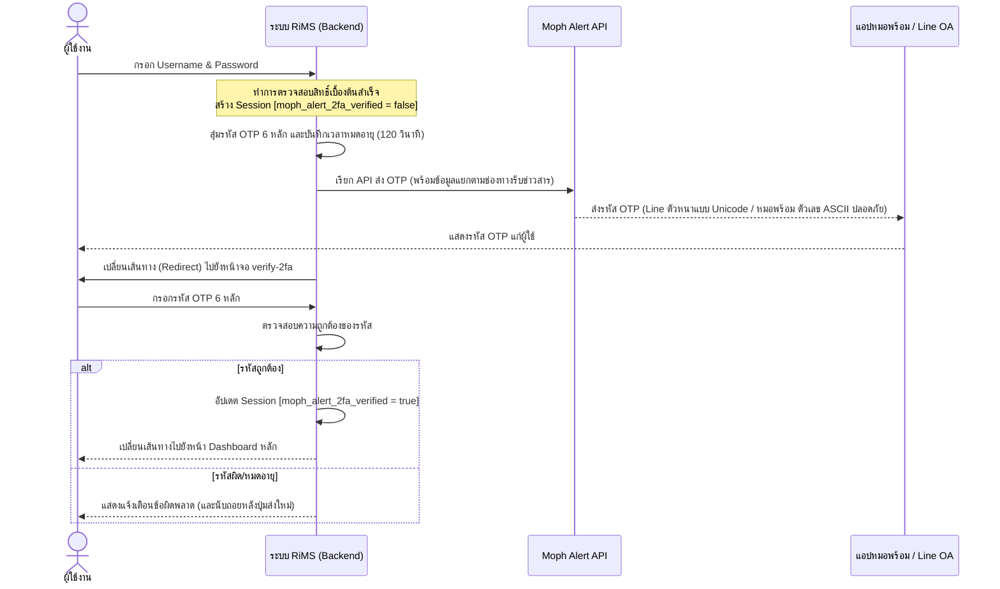

# คู่มือการพัฒนาระบบยืนยันตัวตนสองขั้นตอน (2FA) ผ่าน Moph Alert
คู่มือนี้จัดทำขึ้นเพื่อแสดงโครงสร้างสถาปัตยกรรมและรายละเอียดการเขียนโค้ดในการพัฒนาระบบยืนยันตัวตนสองขั้นตอน (Two-Factor Authentication: 2FA) ผ่านเกตเวย์ **Moph Alert** (ระบบส่งข้อความแจ้งเตือนของกระทรวงสาธารณสุขไปยังแอปพลิเคชันหมอพร้อม และ Line Official Account) โดยเริ่มอธิบายตั้งแต่การตั้งค่าในระบบผู้ดูแลระบบ (Admin Settings) ไปจนถึงขั้นตอนการทำงานในหน้าจอเข้าสู่ระบบ (Login)

---

## 1. ข้อมูลการตั้งค่าระบบ (Admin Configurations)
ระบบใช้ตัวแปรในการตั้งค่า 3 ตัวหลักที่ถูกควบคุมและดึงค่าผ่านคลาส `App\Services\LicenseVerificationService::getConfig` ซึ่งถูกจัดเก็บในตารางการตั้งค่าระบบ (`main_settings`):

1. **`moph_alert_active`**: เปิด/ปิดใช้งานระบบยืนยันตัวตน 2FA Moph Alert (ค่าเปิดใช้งานคือ `'Y'`)
2. **`moph_alert_client_id`**: Client ID ของบัญชี Moph Alert API
3. **`moph_alert_client_secret`**: Client Secret ของบัญชี Moph Alert API

---

## 2. ขั้นตอนสถาปัตยกรรมการทำงาน (2FA Workflow)



---

## 3. การกรองการเข้าถึงหน้าจอด้วย Middleware
ระบบใช้ Middleware ชื่อ `App\Http\Middleware\MophAlert2FAMiddleware` ในการตรวจสอบผู้ใช้ที่ล็อกอินเข้ามาแล้ว แต่ยังไม่ได้ทำการยืนยัน OTP ขั้นที่สอง โดยจะทำการดักจับและเปลี่ยนเส้นทางผู้ใช้ไปยังหน้าป้อนรหัส OTP เสมอ

### โค้ดตัวอย่างการกรองคำขอ (Middleware):
```php
namespace App\Http\Middleware;

use Closure;
use Illuminate\Http\Request;

class MophAlert2FAMiddleware
{
    public function handle(Request $request, Closure $next)
    {
        // 1. ละเว้นการตรวจจับหากเป็นคำขอประเภท AJAX, JSON หรือไฟล์ Static
        if ($request->ajax() || $request->wantsJson() || preg_match('/\.(ico|png|jpg|jpeg|gif|css|js|svg|map|woff|woff2|ttf|eot)$/i', $request->path())) {
            return $next($request);
        }

        // 2. ถ้าผู้ใช้ยังไม่ได้ล็อกอิน ให้ผ่านไปเพื่อให้ Auth Middleware จัดการหลัก
        if (!auth()->check()) {
            return $next($request);
        }

        // 3. ละเว้นหน้าจอการทำ 2FA หรือการออกจากระบบ เพื่อป้องกันการ Redirect Loop
        if ($request->routeIs('auth.2fa.*') || $request->is('login/verify-2fa*') || $request->is('logout') || $request->is('login')) {
            return $next($request);
        }

        // 4. ตรวจสอบการตั้งค่าว่าเปิดใช้งาน 2FA หรือไม่
        $mophAlertActive = \App\Services\LicenseVerificationService::getConfig('moph_alert_active', 'moph_alert_active');
        if ($mophAlertActive !== 'Y') {
            return $next($request);
        }

        // 5. หากล็อกอินแล้วแต่ยังไม่ได้ตรวจสอบรหัสผ่าน 2FA ให้ส่งไปหน้ากรอกรหัส OTP
        if (session('moph_alert_2fa_verified') === false) {
            return redirect()->route('auth.2fa.index');
        }

        return $next($request);
    }
}
```

---

## 4. ตัวควบคุมการสร้างและตรวจสอบ OTP (Controller Logic)
ในคอนโทรลเลอร์ `App\Http\Controllers\Auth\MophAlert2FAController` มีการเก็บสถานะของ OTP ไว้ใน Session เพื่อความปลอดภัยและทำงานได้เร็ว โดยมีโค้ดหลักดังนี้:

### การเก็บและตรวจสอบสถานะ OTP ใน Session:
* **`moph_alert_otp`**: รหัสสุ่ม 6 หลักที่สร้างขึ้น
* **`moph_alert_otp_expires`**: เวลาหมดอายุของรหัส (ตั้งไว้ที่ 120 วินาทีหรือ 2 นาที)
* **`moph_alert_last_sent`**: เวลาล่าสุดที่กดส่งข้อความ (ใช้สำหรับทำ Cooldown ปุ่มกดส่งใหม่ 120 วินาที)

### โค้ดระบบส่งและเรียก API (`MophAlert2FAController`):
```php
protected function sendOTPViaMophAlert($cid, $otp)
{
    if (empty($cid)) {
        Log::warning('Cannot send Moph Alert OTP: User CID is empty.');
        return false;
    }

    $clientId = \App\Services\LicenseVerificationService::getConfig('moph_alert_client_id', 'moph_alert_client_id');
    $clientSecret = \App\Services\LicenseVerificationService::getConfig('moph_alert_client_secret', 'moph_alert_client_secret');

    // Moph Alert Endpoint สำหรับส่งแจ้งเตือน V3.1
    $url = 'https://morpromt2c.moph.go.th/alert/v3.1/messages';

    // แปลงตัวเลขรหัส OTP เป็น Unicode ตัวหนาเพื่อรองรับการแสดงผลสวยงามบนแอป Line
    $boldDigits = [
        '0' => '𝟬', '1' => '𝟭', '2' => '𝟮', '3' => '𝟯', '4' => '𝟰',
        '5' => '𝟱', '6' => '𝟲', '7' => '𝟳', '8' => '𝟴', '9' => '𝟵'
    ];
    $boldOtp = strtr($otp, $boldDigits);

    try {
        $response = Http::withoutVerifying()
            ->withHeaders([
                'Content-Type' => 'application/json',
                'client-key' => $clientId,
                'secret-key' => $clientSecret,
            ])
            ->post($url, [
                'cid' => [(string)$cid],
                'messages' => [
                    [
                        // ส่งตัวหนา Unicode ไปแสดงใน Line Chat bubble อย่างเหมาะสมและคมชัด (ไม่มีแท็ก HTML แสดงผลรบกวนสายตา)
                        'text' => "รหัสยืนยันตัวตน (2FA) สำหรับเข้าระบบ RiMS ของท่านคือ $boldOtp",
                        'type' => 'text'
                    ]
                ],
                'message_title' => "รหัส OTP เข้าสู่ระบบ RiMS",
                // สำหรับหมอพร้อมใช้ tag <strong> ร่วมกับเลข ASCII ธรรมดาเพื่อให้ระบบเรนเดอร์เป็นตัวหนาได้โดยไม่แปลงเป็น ?
                'message_html' => "<div>รหัสยืนยันตัวตน (2FA) สำหรับเข้าระบบ RiMS ของท่านคือ <strong>$otp</strong></div>",
                'message_text' => "รหัส OTP ของท่านคือ $otp",
                'message_type' => "HPT"
            ]);

        // ... (ระบบมีโครงสร้าง Logic สำหรับตรวจจับ HTTP 401 เพื่อขอรับ Client Key กลางอัตโนมัติ)
    } catch (\Exception $e) {
        Log::error("Error sending Moph Alert OTP: " . $e->getMessage());
        return false;
    }
}
```

---

## 5. เทคนิคพิเศษในการจัดฟอร์แมตตัวเลข OTP (Format Handling)

เพื่อให้ข้อความมีสไตล์ที่สวยงาม อ่านง่าย ชัดเจน แต่มีความเสถียรและปลอดภัยในการใช้งาน ได้มีการใช้ฟอร์แมตที่แตกต่างกันไปในแต่ละฟิลด์ของข้อมูลปลายทาง:

| ชื่อฟิลด์ใน Payload | ปลายทางการแสดงผล | รูปแบบข้อมูลที่ส่ง | เหตุผลทางด้านเทคนิค |
| :--- | :--- | :--- | :--- |
| `messages[0]['text']` | **Line Chat Room** | ตัวเลข Unicode ตัวหนา (`$boldOtp`) | แอป Line บนโทรศัพท์มือถือสามารถเรนเดอร์ตัวอักษรพิเศษนี้ออกมาเป็น**ตัวหนา**ได้อย่างสวยงาม โดยไม่ต้องใส่แท็ก `<strong>` ซึ่งจะแสดงออกมาเป็นข้อความแท็กดิบในห้องแชทให้ผู้ใช้สับสน |
| `message_text` | **แอปหมอพร้อม (ตัวหนังสือแจ้งเตือน)** | ตัวเลข ASCII ธรรมดา (`$otp`) | เกตเวย์ส่งออกข้อมูลของหมอพร้อมจำกัดการส่งผ่านระบบอักขระแบบ UTF-8 3-Byte หากใช้ตัวหนาแบบ Unicode (4-Byte) ข้อมูลรหัสจะแสดงเป็นเครื่องหมายคำถาม (`??????`) |
| `message_html` | **แอปหมอพร้อม (การแสดงผลข้อความ HTML)** | HTML `<strong>$otp</strong>` | หมอพร้อมรองรับการตีความโค้ดและเรนเดอร์ HTML ในส่วนนี้ได้อย่างถูกต้อง ปลอดภัย ไม่แสดงผลเป็นเครื่องหมายคำถาม |

---

## 6. หน้าจอผู้ใช้สำหรับกรอกรหัส (Verification View)
หน้าจอรับรหัส `verify-2fa.blade.php` มีองค์ประกอบหลัก ๆ ที่จำเป็นต้องนำไปพัฒนาต่อสำหรับหน้าจอยืนยันของระบบอื่น ดังนี้:

1. **กล่องป้อนรหัส (OTP Input Field)**:
   * บังคับความยาว 6 ตัวอักษร (`maxlength="6"`)
   * ปิดการใช้งานหากไม่มีรหัสบัตรประชาชนของผู้ใช้ส่งเข้ามาป้องกันความผิดพลาด
2. **ระบบนับถอยหลังส่งรหัสซ้ำ (Countdown Timer)**:
   * ใช้ JavaScript คำนวณความต่างเวลาของเครื่องผู้ใช้กับเวลาใน Session เพื่อแสดงเวลานับถอยหลัง 120 วินาทีที่สมจริง
   * ซ่อนลิงก์ "ส่งรหัสใหม่อีกครั้ง" และแสดงเวลานับถอยหลัง เมื่อหมดเวลาจึงสลับให้ปุ่มส่งรหัสขึ้นมาแสดงแทน
3. **ระบบ Auto-Submit**:
   * มีการดักจับ Event `input` เมื่อผู้ใช้กรอกข้อความครบ 6 ตัวอักษร ระบบจะส่งฟอร์มเพื่อยืนยันตัวตนให้อัตโนมัติทันที
   * ป้องกันการกรอกอักขระพิเศษอื่นที่ไม่ใช่ตัวอักษรและตัวเลข (`/[^a-zA-Z0-9]/g`)

### สคริปต์ JavaScript หน้าจอกรอกรหัส:
```javascript
document.addEventListener('DOMContentLoaded', function () {
    const otpInput = document.getElementById('otp_code');

    // ตรวจสอบเมื่อมีการกรอกข้อมูลครบ 6 หลัก ให้ส่งฟอร์มส่งข้อมูลอัตโนมัติ
    if (otpInput) {
        otpInput.addEventListener('input', function() {
            this.value = this.value.replace(/[^a-zA-Z0-9]/g, ''); // กรองเฉพาะ A-Z, a-z, 0-9
            if (this.value.length === 6) {
                this.closest('form').submit();
            }
        });
    }
    
    // ตั้งค่าเวลานับถอยหลังปุ่ม Resend (ดึงค่าเวลาที่เหลืออยู่จริงมาจาก Session)
    let timeLeft = {{ $remaining }}; 
    if (timeLeft > 0) {
        const timerInterval = setInterval(function () {
            timeLeft--;
            document.getElementById('timer-seconds').innerText = Math.ceil(timeLeft);
            if (timeLeft <= 0) {
                clearInterval(timerInterval);
                document.getElementById('countdown-text').classList.add('d-none');
                document.getElementById('resend-form').classList.remove('d-none');
            }
        }, 1000);
    }
});
```

---
*คู่มือฉบับนี้จัดทำขึ้นโดยอ้างอิงจากโครงสร้างจริงของระบบ RiMS (เวอร์ชัน V.69-08-22)*
