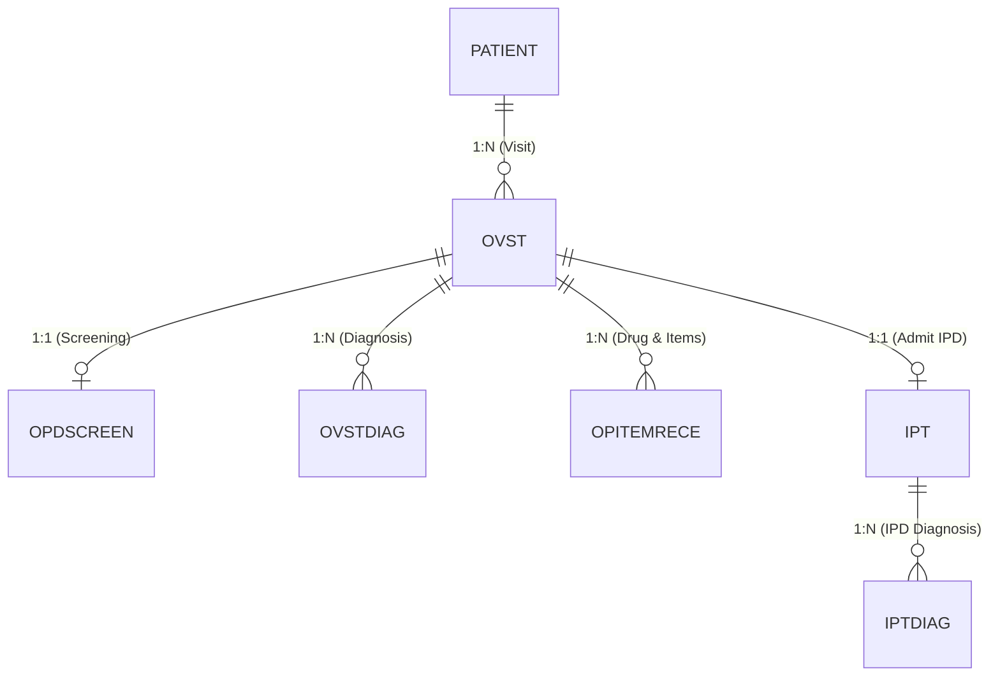

# 05. การฝัง Addon ในหน้าจอ HOSxP & ตารางมาตรฐาน

> การเชื่อมต่อหน้าจอ UI ของ SmartData เข้ากับ HOSxP ผ่าน Browser Embed / WebView

---

## 1. การรับบริบทผู้ป่วยจาก HOSxP (Patient Context)

เมื่อผู้ใช้กดเปิด Addon จากเมนูหรือปุ่มใน HOSxP ตัวโปรแกรมจะส่ง Parameter ต่อท้าย URL ดังนี้:

```http
https://smartdata.local/app?bms-session-id=...&hn=0001234&vn=671004083012&an=67000123
```

### ⚠️ กฎสำคัญ 2 ข้อที่ต้องระวังเป็นพิเศษ:
1. **Parameter Name เป็นตัวพิมพ์เล็กเสมอ:**
   - ใช้ `hn`, `vn`, `an` (ห้ามใช้ `HN`, `VN`, `AN` หรือ `Hn`)
2. **รักษาเลข 0 นำหน้า (Zero-Padding Preservation):**
   - เช่น `hn = "0001234"` หรือ `vn = "012345"`
   - **ห้ามแปลงเป็น Integer เด็ดขาด** เพราะเลข `0001234` จะกลายเป็น `1234` ทำให้ Query ไม่พบข้อมูลใน HOSxP ให้รับและเก็บเป็น **String** เสมอ

---

## 2. พจนานุกรมตาราง HOSxP ที่ใช้บ่อย (Common Tables)



### ตารางหลักในระบบงานบริการทางการแพทย์:

| ชื่อตาราง | คำอธิบาย | ฟิลด์สำคัญ | คีย์หลัก (Primary Key) |
| :--- | :--- | :--- | :--- |
| **`patient`** | ข้อมูลประชากร/ผู้ป่วย | `hn`, `cid`, `pname`, `fname`, `lname`, `birthday`, `sex`, `bloodgrp`, `addrpart` | `hn` (String) |
| **`ovst`** | การเข้ารับบริการผู้ป่วยนอก (OPD Visit) | `vn`, `hn`, `vstdate`, `vsttime`, `main_dep`, `cur_dep`, `pt_subtype` | `vn` (String) |
| **`opdscreen`** | ข้อมูลคัดกรอง / สัญญาณชีพ (Vital Signs) | `opdscreen_id`, `vn`, `hn`, `bps`, `bpd`, `pulse`, `temperature`, `rr`, `bw`, `height`, `bmi`, `cc`, `pe` | `opdscreen_id` (BigInt) |
| **`ovstdiag`** | การวินิจฉัยโรคผู้ป่วยนอก (ICD-10) | `ovst_diag_id`, `vn`, `hn`, `icd10`, `diagtype`, `doctor`, `vstdate` | `ovst_diag_id` (BigInt) |
| **`opitemrece`** | การสั่งยา / เวชภัณฑ์ / ค่าบริการ | `opitemrece_id`, `vn`, `hn`, `an`, `icode`, `qty`, `unitprice`, `sum_price`, `doctor` | `opitemrece_id` (BigInt) |
| **`ipt`** | การรับผู้ป่วยใน (IPD Admission) | `an`, `hn`, `vn`, `regdate`, `regtime`, `dchdate`, `dchtime`, `ward`, `dchtype`, `dchstts` | `an` (String) |
| **`lab_head`** | ใบสั่งตรวจทางห้องปฏิบัติการ (Lab Request) | `lab_order_number`, `vn`, `hn`, `order_date`, `order_time`, `department` | `lab_order_number` (Int) |
| **`lab_order`** | ผลการตรวจทางห้องปฏิบัติการ (Lab Results) | `lab_order_number`, `lab_items_code`, `lab_order_result`, `lab_order_result_unit` | `lab_order_number` + `lab_items_code` |
| **`drugitems`** | บัญชีรายการยาและเวชภัณฑ์ | `icode`, `name`, `strength`, `units`, `unitcost`, `unitprice`, `dosageform` | `icode` (String) |
| **`clinic`** | คลินิกเฉพาะทาง (เบาหวาน, ความดัน, ฯลฯ) | `clinic`, `name` | `clinic` (String) |

---

## 3. รูปแบบการเขียน SQL ดึงข้อมูลประวัติผู้ป่วย (Sample Queries)

### ดึงข้อมูล Visit ล่าสุดพร้อมผลการตรวจร่างกาย
```sql
SELECT 
    p.hn,
    CONCAT(p.pname, p.fname, ' ', p.lname) AS patient_name,
    o.vn,
    o.vstdate,
    o.vsttime,
    s.bps,
    s.bpd,
    s.pulse,
    s.temperature,
    s.cc,
    s.pe
FROM ovst o
LEFT JOIN patient p ON p.hn = o.hn
LEFT JOIN opdscreen s ON s.vn = o.vn
WHERE o.hn = :hn
ORDER BY o.vstdate DESC, o.vsttime DESC
LIMIT 10;
```
