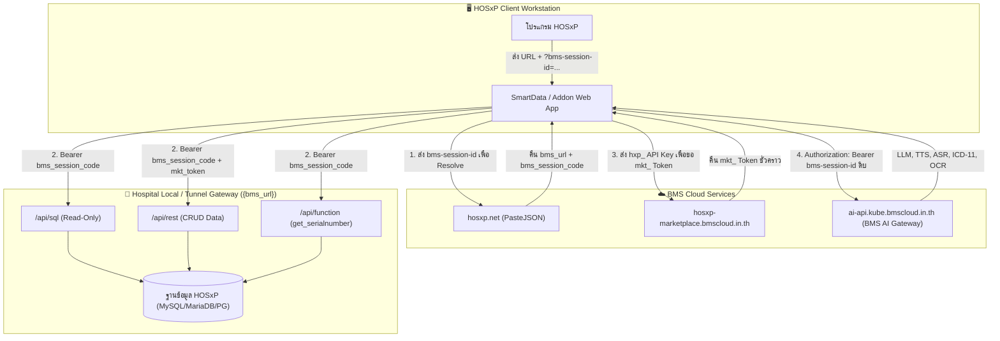

# คู่มือการเชื่อมต่อ BMS Session API & HOSxP Ecosystem
> **SmartData Developer & Integration Guide**  
> เอกสารฉบับสมบูรณ์สำหรับการเชื่อมต่อ HOSxP, BMS Session API, HOSxP Marketplace, Cloud KV Storage และ BMS Cloud AI Services

---

## 📌 สารบัญคู่มือ (Table of Contents)

1. [**01. สถาปัตยกรรมและการยืนยันตัวตน (Tokens & Auth Model)**](./01-tokens-and-auth.md)
   - วงจรชีวิตของ BMS Session
   - Token ทั้ง 4 ชนิด (`bms-session-id`, `bms_session_code`, `hxp_...`, `mkt_...`)
   - การ Resolve ผ่าน PasteJSON (`hosxp.net`)
   - นโยบายความปลอดภัยและการทำ Data Masking ในโหมดพัฒนา

2. [**02. API ข้อมูล HOSxP (SQL, REST, Functions)**](./02-data-api-sql-rest-functions.md)
   - การรันคำสั่ง SQL ผ่าน `/api/sql` (Read-only, Binding, Limits)
   - การจัดการข้อมูลผ่าน `/api/rest` (Filter, Join/Expand, Write Data)
   - Server Functions `/api/function` (`get_serialnumber`, `get_hosvariable`)
   - Pattern สำคัญ: การสร้าง Primary Key สำหรับตาราง HOSxP ที่ไม่มี AUTO_INCREMENT

3. [**03. บริการ BMS Cloud AI Services**](./03-bms-ai-services.md)
   - LLM Chat Completions (`/v1/chat/completions` มาตรฐาน OpenAI, Dynamic `/v1/models`)
   - การถอดความเสียงภาษาไทย Thai ASR (`/v1/audio/transcriptions`)
   - การสังเคราะห์เสียงภาษาไทย Thai TTS & Text Normalize (`/v1/audio/speech`, `/v1/audio/normalize`)
   - ระบบค้นหารหัสโรคอัตโนมัติ ICD-11 Semantic Lookup (`/v1/icd11/lookup`)
   - การสกัดข้อมูลเอกสารและผลแล็บ Medical Document OCR (`/v1/ocr/extract`)

4. [**04. Marketplace & Cloud User Storage (KV Store)**](./04-marketplace-and-storage.md)
   - การลงทะเบียน Addon และขอสิทธิ์ Token (`POST /api/v1/addon/token`)
   - การรายงานการใช้งานและเครดิต (`POST /api/v1/addon/usage`)
   - Cloud Key-Value Storage สำหรับเก็บ Preferences/Configs แยกตาม User & Hospital

5. [**05. การฝัง Addon ในหน้าจอ HOSxP & ตารางมาตรฐาน**](./05-hosxp-ui-integration.md)
   - การรับค่าบริบทผู้ป่วย (`hn`, `vn` ตัวพิมพ์เล็ก และการรักษาเลข 0 นำหน้า)
   - จุดเชื่อมต่อในหน้าจอต่างๆ ของ HOSxP (OPD, IPD, คัดกรอง, ห้องยา)
   - พจนานุกรมตาราง HOSxP ที่ใช้บ่อย (`patient`, `ovst`, `opdscreen`, `opitemrece`, `ovstdiag`, `ipt`, ฯลฯ)

6. [**06. ตัวอย่างการพัฒนาด้วย Laravel ใน SmartData**](./06-laravel-implementation-examples.md)
   - Service Class สำหรับ Resolve Session และยิง Data API (`BmsSessionService.php`)
   - Service Class สำหรับเชื่อมต่อ BMS AI Gateway (`BmsAiService.php`)
   - ตัวอย่างการนำไปใช้ใน Controller และ Blade View

---

## 🗺️ แผนผังภาพรวมการเชื่อมต่อระบบ (System Architecture)

---

## 💡 สรุป Endpoint หลักที่ใช้งานบ่อย

| หมวดหมู่ | Base URL / Host | Endpoint | Header สำคัญ |
| :--- | :--- | :--- | :--- |
| **Resolve Session** | `https://hosxp.net` | `/phps/bms_session_paste.php` | Query param `?bms-session-id=...` |
| **SQL Query** | `{bms_url}` | `POST /api/sql` | `Authorization: Bearer {bms_session_code}` |
| **REST CRUD** | `{bms_url}` | `/api/rest/{table}[/{id}]` | `Authorization: Bearer {bms_session_code}` `X-Marketplace-Token: {mkt_token}` *(เมื่อเขียน)* |
| **Function** | `{bms_url}` | `POST /api/function?name=get_serialnumber` | `Authorization: Bearer {bms_session_code}` |
| **Marketplace Token** | `https://hosxp-marketplace.bmscloud.in.th` | `POST /api/v1/addon/token` | `X-Addon-Key: {hxp_...}` |
| **User Storage** | `https://hosxp-marketplace.bmscloud.in.th` | `/api/v1/addon/storage/{key}` | `X-BMS-Session-Id: {session_id}` `X-Marketplace-Token: {hxp_...}` |
| **AI LLM Chat** | `https://ai-api.kube.bmscloud.in.th` | `POST /v1/chat/completions` | `Authorization: Bearer {bms-session-id}` |
| **AI Speech-to-Text** | `https://ai-api.kube.bmscloud.in.th` | `POST /v1/audio/transcriptions` | `Authorization: Bearer {bms-session-id}` |
| **AI Text-to-Speech** | `https://ai-api.kube.bmscloud.in.th` | `POST /v1/audio/speech` | `Authorization: Bearer {bms-session-id}` |
| **AI ICD-11 Lookup** | `https://ai-api.kube.bmscloud.in.th` | `POST /v1/icd11/lookup` | `Authorization: Bearer {bms-session-id}` |
| **AI Medical OCR** | `https://ai-api.kube.bmscloud.in.th` | `POST /v1/ocr/extract` | `Authorization: Bearer {bms-session-id}` |
